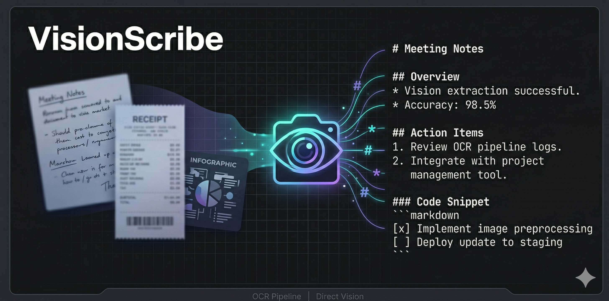
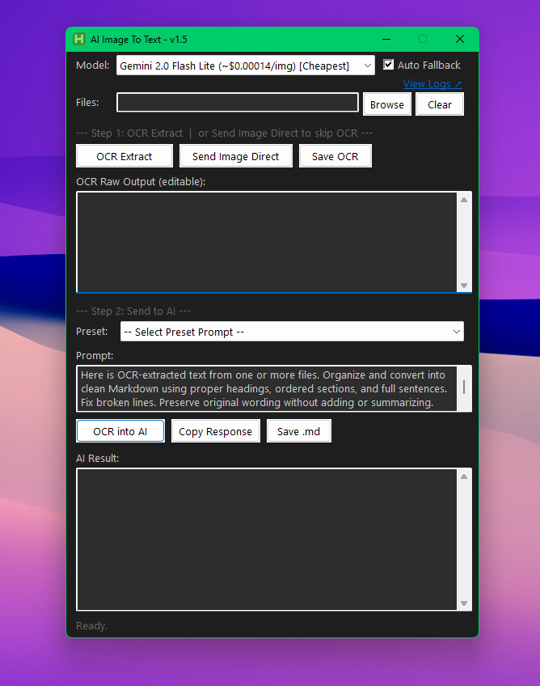

# VisionScribe



Desktop tool for extracting text from images and converting it to clean Markdown. Built with AutoHotkey v2 + Python + Tesseract-OCR, powered by OpenRouter vision models.

Two pipelines:
- **OCR Pipeline** - Tesseract extracts raw text into an editable box, then an AI text model cleans and formats it. Best for clean printed images where OCR output is mostly readable.
- **Direct Vision** - skips OCR entirely, sends images straight to a vision model. Use for handwriting, stylised fonts, complex tables, or low-contrast images where OCR produces garbage.

---

## Screenshot



---

## Files

| File | Purpose |
|------|---------|
| `VisionScribe_v2.ahk` | Current script - v1.6 feature set, v2.0 (InstaSnap + Notion) not yet added |
| `InstaImage2TextConverter.py` | Python CLI helper - OCR and Direct Vision modes |
| `config.ini` | Local settings - API key, Tesseract path, models, prompts. Gitignored. |
| `config - example.ini` | Committed template - copy this to `config.ini` to get started |

---

## Prerequisites

| Dependency | Required for | Minimum version |
|------------|-------------|-----------------|
| AutoHotkey v2 | Running the `.ahk` script | 2.0+ |
| Python | Both pipelines | 3.8+ |
| Tesseract OCR | OCR Pipeline only | 5.x |
| OpenRouter API key | Both AI pipelines | - |

---

## Setup

### Quick check - run these before first launch

| Dependency | Verify command | Expected |
|------------|---------------|----------|
| AutoHotkey v2 | `"C:\Program Files\AutoHotkey\v2\AutoHotkey.exe" --version` | `2.x.x` |
| Python | `python --version` | `3.8+` |
| pip packages | `pip show pytesseract pillow requests` | All three listed |
| Tesseract | `"C:\Program Files\Tesseract-OCR\tesseract.exe" --version` | `tesseract 5.x` |

Tesseract is OCR Pipeline only. Skip steps 3-4 if you only use Direct Vision.

---

### 1. AutoHotkey v2

Download and install: https://www.autohotkey.com

Verify install (PowerShell):
```powershell
Test-Path "C:\Program Files\AutoHotkey\v2\AutoHotkey.exe"
```

Returns `True` if installed correctly.

---

### 2. Python 3.8+

Download: https://www.python.org/downloads/

During install - check **"Add Python to PATH"** before clicking Install Now.

Verify:
```
python --version
```

Install required packages:
```
pip install pytesseract pillow requests
```

Verify packages installed:
```
pip show pytesseract pillow requests
```

| Package | Required for |
|---------|-------------|
| `pytesseract` | OCR Pipeline only |
| `pillow` | OCR Pipeline only |
| `requests` | Direct Vision + v2.0 InstaSnap fetch |

---

### 3. Tesseract OCR

Required for **OCR Pipeline only** - skip if you only use Direct Vision.

Download Windows installer: https://github.com/UB-Mannheim/tesseract/wiki

Default install path: `C:\Program Files\Tesseract-OCR\`

Verify:
```
tesseract.exe --version
```

If installed to a different path, update `config.ini`:
```ini
[Paths]
TesseractExe = D:\Tools\Tesseract-OCR\tesseract.exe
```

| Symptom | Fix |
|---------|-----|
| "Tesseract not found" | Path in `config.ini [Paths] TesseractExe` doesn't match actual install location |
| Garbled or empty output | Image resolution too low - switch to Direct Vision instead |
| Wrong language detected | Reinstall Tesseract and select additional language packs during setup |

---

### 4. OpenRouter API Key

Sign up: https://openrouter.ai → Keys → Create Key

Paste the key into `config.ini`:
```ini
[API]
Key = sk-or-v1-...
```

Minimum $1 credit covers thousands of requests at the default model rates. Monitor usage at https://openrouter.ai/logs

---

### 5. Running

Double-click `VisionScribe_v2.ahk`, or from terminal:
```
"C:\Program Files\AutoHotkey\v2\AutoHotkey.exe" "VisionScribe_v2.ahk"
```

`Ctrl+S` while the script is running reloads it (dev shortcut).

---

## Configuration (`config.ini`)

Copy `config - example.ini` → `config.ini` and fill in your key.

```ini
[API]
Key = sk-or-v1-...
Url = https://openrouter.ai/api/v1/chat/completions

[Paths]
TesseractExe = C:\Program Files\Tesseract-OCR\tesseract.exe

[Models]
; First entry = default selected on launch
Count = 3
1_Label = Gemini 2.0 Flash Lite (~$0.00014/img) [Cheapest]
1_Id    = google/gemini-2.0-flash-lite-001
2_Label = Llama 3.2 11B Vision  (~$0.00018/img) [Backup]
2_Id    = meta-llama/llama-3.2-11b-vision-instruct
3_Label = Gemini 2.0 Flash      (~$0.00019/img) [Accurate]
3_Id    = google/gemini-2.0-flash-001

[Prompts]
; Each entry must be a single line. Increment Count when adding new presets.
Count = 11
1_Title = Organize to Markdown [OCR]
1_Text  = Here is OCR-extracted text...

[State]
; Auto-written by the app - do not edit manually
LastFolder =
```

Models and prompts load from config at startup - add or swap without touching any AHK code.

---

## How to Use

### OCR Pipeline

1. Launch `VisionScribe_v2.ahk`
2. **Browse** - select images (`.jpg .png .bmp .tiff .gif`) or text files (`.txt .md`)
3. **OCR Extract** - raw text appears in the editable OCR box (text files are read directly, no OCR)
4. Review and correct any OCR errors
5. Select a model and preset prompt (prompt box fills automatically)
6. **OCR into AI** - result appears in the AI Result box
7. **Copy Response** or **Save .md**

**Save OCR** saves the raw OCR box content to `.txt` before the AI step - useful for keeping the unprocessed intermediate.

### Direct Vision

1. Browse and select image files
2. Select a preset prompt or write your own
3. **Send Image Direct** - Python base64-encodes the images and calls the vision API
4. Result appears in the AI Result box, editable before saving

**Auto Fallback** - if the selected model returns a rate-limit error (HTTP 429), VisionScribe automatically retries with the remaining models in config order.

---

## Preset Prompts

| # | Title | Mode |
|---|-------|------|
| 1 | Organize to Markdown | OCR |
| 2 | Extract Text Verbatim | Vision |
| 3 | Extract Table to Markdown | OCR / Vision |
| 4 | Extract Key-Value Pairs | OCR / Vision |
| 5 | Extract Handwritten Text | Vision |
| 6 | Summarize Content | OCR / Vision |
| 7 | Proofread and Clean | OCR |
| 8 | Translate to English | OCR / Vision |
| 9 | Extract Invoice or Receipt | Vision |
| 10 | Convert to JSON | OCR / Vision |
| 11 | Extract Instagram Post Content | Vision |

---

## Python CLI (`InstaImage2TextConverter.py`)

The AHK script shells out to this helper. You can also call it directly:

```bash
# OCR Pipeline
python InstaImage2TextConverter.py --tesseract "C:\...\tesseract.exe" "img1.png" "img2.png"

# Direct Vision
python InstaImage2TextConverter.py --direct --apikey "sk-..." --model "google/gemini-2.0-flash-lite-001" --prompt "Extract all text" "img1.png"
```

Output goes to stdout. AHK captures it via a temp file.

---

## Notes

- `Ctrl+S` reloads the running script during development
- Multi-file selections are naturally sorted (`img2` before `img10`)
- Last used folder persists across sessions via `config.ini [State]`
- The GUI freezes during API calls - expected behaviour (`WinHTTP` runs synchronously)
- View usage and costs: https://openrouter.ai/logs

---

## Roadmap

See `roadmap.md`. Next: **v2.0** - InstaSnap (Instagram URL → oEmbed fetch → vision pipeline) and Notion push output. Not yet implemented in `VisionScribe_v2.ahk`.
